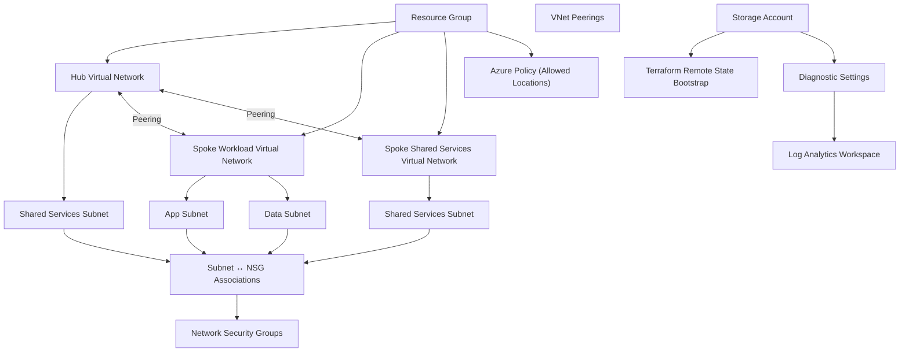

# Azure Landing Zone Lite Foundation

## Overview

This repository contains a lightweight Azure Landing Zone built with Terraform.

The project serves as a learning and portfolio environment to demonstrate Infrastructure as Code (IaC), Azure networking, GitHub Actions, Azure Policy, Monitoring, and cloud engineering best practices.

The goal is to build a modular and production-inspired Azure foundation while following modern cloud architecture principles.

---

## Architecture

Current architecture:



---

## Features

### Networking

- Hub-and-Spoke architecture
- Virtual Networks
- Subnets
- Network Security Groups
- Subnet ↔ NSG Associations
- VNet Peering

### Monitoring

- Log Analytics Workspace
- Diagnostic Settings

### Governance

- Azure Policy (Allowed Locations)
- Modular policy assignments

### Storage

- Storage Account module
- Bootstrap configuration for Azure Remote State
- Blob Container for Terraform state

### Terraform

- Reusable Terraform modules
- Root and child module architecture
- Variables and outputs
- `for_each` based deployments

### DevOps

- GitHub Flow
- Feature Branches
- Pull Requests
- GitHub Actions CI Pipeline
- Azure OpenID Connect (OIDC)

---

## CI/CD Pipeline

The GitHub Actions workflow automatically performs:

- Terraform Format Check
- Terraform Init
- Terraform Validate
- Terraform Plan

Azure authentication is implemented using OpenID Connect (OIDC), eliminating the need for long-lived credentials or secrets.

---

## Repository Structure

```text
.
├── .github/
│   └── workflows/
│
├── bootstrap/
│   └── tfstate/
│
├── modules/
│   ├── diagnostic-setting/
│   ├── log-analytics/
│   ├── network-security-group/
│   ├── policy-assignment/
│   ├── storage-account/
│   ├── subnet/
│   ├── subnet-nsg-association/
│   ├── virtual-network/
│   └── vnet-peering/
│
├── backend.tf.example
├── main.tf
├── outputs.tf
├── providers.tf
├── variables.tf
├── versions.tf
└── terraform.tfvars.example
```

---

## Terraform Remote State

This repository contains a dedicated bootstrap project located in:

```text
bootstrap/tfstate
```

The bootstrap configuration creates:

- Resource Group
- Storage Account
- Blob Container

After deploying the bootstrap resources, the landing zone can migrate from a local Terraform state to an Azure Storage backend.

Migration steps:

1. Deploy the bootstrap configuration.
2. Copy `backend.tf.example` to `backend.tf`.
3. Replace the placeholder values.
4. Run:

```bash
terraform init -migrate-state
```

The backend configuration is intentionally **not enabled by default**, allowing the repository to be cloned and explored without requiring existing Azure infrastructure.

---

## Security

Security best practices implemented:

- No secrets stored in Git
- Local `terraform.tfvars` excluded via `.gitignore`
- Azure OpenID Connect (OIDC)
- GitHub Repository Variables
- No long-lived Azure credentials

---

## Prerequisites

- Terraform
- Azure CLI
- Azure Subscription
- Git
- GitHub Account

---

## Getting Started

Clone the repository:

```bash
git clone https://github.com/mikeCayan99/azure-landing-zone-lite-foundation-.git
```

Initialize Terraform:

```bash
terraform init
```

Validate the configuration:

```bash
terraform validate
```

Generate an execution plan:

```bash
terraform plan
```

---

## Note

> This repository is designed as a learning and portfolio project.
>
> To keep the project free to use and avoid unnecessary Azure costs, the complete landing zone has **not been deployed** by default.
>
> All infrastructure changes are validated using `terraform plan`. Resources can be deployed individually when required.

## Current Status

Implemented:

- Resource Group
- Hub-and-Spoke Networking
- Virtual Networks
- Subnets
- Network Security Groups
- Subnet ↔ NSG Associations
- VNet Peering
- Log Analytics Workspace
- Diagnostic Settings
- Azure Policy (Allowed Locations)
- Storage Account Module
- Terraform Remote State Bootstrap
- GitHub Actions CI
- Azure OIDC Authentication

---

## Roadmap

Planned improvements:

- Azure Remote State Migration
- RBAC Examples
- Custom Azure Roles
- Key Vault Integration
- Additional Azure Policies

---

## Learning Objectives

This project focuses on learning and demonstrating:

- Azure networking fundamentals
- Infrastructure as Code (Terraform)
- Modular Terraform architecture
- Azure Landing Zone concepts
- Azure Policy
- Monitoring and Diagnostics
- GitHub Actions
- CI/CD practices
- Azure OpenID Connect (OIDC)
- Cloud governance fundamentals