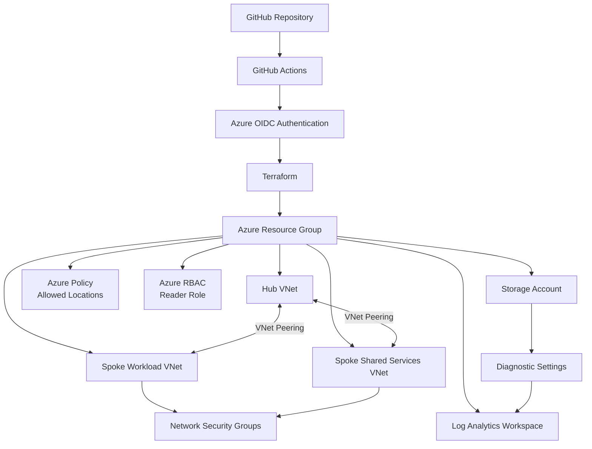

# Azure Landing Zone Lite Foundation

> **Status:** 🚧 Work in Progress

A lightweight Azure Landing Zone built with Terraform and GitHub Actions, focusing on modular Infrastructure as Code, Azure networking, governance, monitoring, RBAC, and secure CI authentication.

---

## Overview

This repository demonstrates the incremental development of a lightweight Azure Landing Zone using Terraform.

The project provides a modular Azure foundation based on a Hub-and-Spoke network architecture and combines networking, governance, monitoring, role-based access control, remote state preparation, and GitHub Actions.

Infrastructure changes are developed through feature branches and pull requests and validated through an automated Terraform CI pipeline.

The project intentionally focuses on core Landing Zone concepts without deploying expensive Azure services that would require a permanently running environment.

---

## Architecture


```mermaid
flowchart TB
    GH["GitHub Repository"]
    GHA["GitHub Actions"]
    OIDC["Azure OIDC Authentication"]
    TF["Terraform"]

    RG["Azure Resource Group"]

    HUB["Hub VNet"]
    SPOKE1["Spoke Workload VNet"]
    SPOKE2["Spoke Shared Services VNet"]

    NSG["Network Security Groups"]

    LAW["Log Analytics Workspace"]
    DIAG["Diagnostic Settings"]

    POLICY["Azure Policy<br/>Allowed Locations"]
    RBAC["Azure RBAC<br/>Reader Role"]

    STORAGE["Storage Account"]

    GH --> GHA
    GHA --> OIDC
    OIDC --> TF
    TF --> RG

    RG --> HUB
    RG --> SPOKE1
    RG --> SPOKE2

    HUB <-->|VNet Peering| SPOKE1
    HUB <-->|VNet Peering| SPOKE2

    SPOKE1 --> NSG
    SPOKE2 --> NSG

    RG --> LAW
    STORAGE --> DIAG
    DIAG --> LAW

    RG --> POLICY
    RG --> RBAC

    RG --> STORAGE
```

---

## Current Infrastructure

The Landing Zone currently includes:

- Azure Resource Group
- Hub Virtual Network
- Workload Spoke Virtual Network
- Shared Services Spoke Virtual Network
- Multiple Azure Subnets
- Network Security Groups
- Subnet-to-NSG Associations
- VNet Peering
- Log Analytics Workspace
- Diagnostic Settings
- Azure Policy assignment
- Azure RBAC role assignment
- Storage Account
- Terraform remote state bootstrap configuration
- Modular Terraform architecture
- GitHub Actions CI
- Azure OpenID Connect authentication

---

## Terraform Architecture

Infrastructure is separated into reusable Terraform modules.

```text
.
├── .github/
│   └── workflows/
│
├── bootstrap/
│   └── tfstate/
│
├── modules/
│   ├── diagnostic-setting/
│   ├── log-analytics/
│   ├── network-security-group/
│   ├── policy-assignment/
│   ├── role-assignment/
│   ├── storage-account/
│   ├── subnet/
│   ├── subnet-nsg-association/
│   ├── virtual-network/
│   └── vnet-peering/
│
├── backend.tf.example
├── main.tf
├── outputs.tf
├── providers.tf
├── variables.tf
├── versions.tf
├── terraform.tfvars.example
└── README.md
```

The root module orchestrates the individual child modules and connects their dependencies through explicit inputs and outputs.

This structure keeps individual infrastructure components isolated and reusable while maintaining a central configuration for the Landing Zone.

---

## Networking

The network architecture follows a lightweight Hub-and-Spoke design.

```text
                     Hub VNet
                    /        \
                   /          \
            Peering            Peering
               /                  \
              ↓                    ↓
     Workload Spoke        Shared Services Spoke
        │     │                     │
        │     │                     │
       App   Data              Shared Services
      Subnet Subnet                Subnet
```

The Hub provides the central network foundation while separate Spoke VNets represent isolated workload and shared-service environments.

Network Security Groups are associated with the appropriate subnets through dedicated Terraform modules.

This architecture provides a foundation that can later be extended with services such as Azure Firewall, Bastion, Private Endpoints, or hybrid connectivity.

---

## Governance

Azure Policy is used to demonstrate governance controls within the Landing Zone.

The current implementation includes an Allowed Locations policy assignment.

```text
Azure Resource Group
        ↓
Azure Policy Assignment
        ↓
Allowed Locations
        ↓
Deployment Governance
```

This provides a lightweight example of how organizations can enforce infrastructure requirements through policy rather than relying only on developer conventions.

Additional policies can be introduced as the Landing Zone evolves.

---

## Security

Security is implemented using Azure-native identity and authorization mechanisms.

### Azure RBAC

A reusable Terraform role-assignment module provides Azure Role-Based Access Control.

The current implementation demonstrates a Reader role assignment at Resource Group scope.

```text
Configured Principal
        ↓
Principal ID
        ↓
Azure RBAC
        ↓
Reader Role
        ↓
Resource Group Scope
```

The RBAC module separates three important authorization properties:

```text
Principal
+
Role
+
Scope
```

This makes role assignments reusable and allows additional identities and roles to be introduced without duplicating Terraform resources.

### OpenID Connect

GitHub Actions authenticates against Azure using OpenID Connect (OIDC).

```text
GitHub Actions
      ↓
OIDC Token
      ↓
Microsoft Entra ID
      ↓
Azure
```

This avoids storing long-lived Azure client secrets in GitHub.

No passwords, API keys, access keys, or cloud credentials are intentionally stored in this repository.

---

## Observability

The Landing Zone includes Azure-native monitoring components.

### Log Analytics Workspace

A Log Analytics Workspace provides the central foundation for collecting and querying Azure telemetry.

### Diagnostic Settings

Diagnostic Settings demonstrate how Azure resource telemetry can be forwarded to the central Log Analytics Workspace.

```text
Azure Resource
      ↓
Diagnostic Settings
      ↓
Log Analytics Workspace
```

This provides the foundation for centralized monitoring and can later be extended with alerts, dashboards, additional diagnostic categories, and Microsoft Defender integrations.

---

## Terraform Remote State

The repository contains a dedicated Terraform bootstrap configuration:

```text
bootstrap/tfstate
```

Its purpose is to prepare the Azure infrastructure required for storing Terraform state remotely.

The bootstrap configuration creates the foundation for:

- Resource Group
- Storage Account
- Blob Container

Conceptually:

```text
Bootstrap Terraform
        ↓
Azure Resource Group
        ↓
Storage Account
        ↓
Blob Container
        ↓
Terraform Remote State
```

The bootstrap project exists because the Storage Account used by the Terraform backend must exist before the main Terraform configuration can use it.

The repository also contains:

```text
backend.tf.example
```

After the backend infrastructure has been deployed, this file can be used as the basis for configuring the Azure Storage backend.

A state migration can then be performed using:

```bash
terraform init -migrate-state
```

The remote backend is intentionally prepared but not enabled by default.

Terraform state files are not stored in Git.

---

## Continuous Integration

GitHub Actions provides automated Terraform validation.

The current workflow follows this process:

```text
Feature Branch
      ↓
Push
      ↓
Pull Request
      ↓
GitHub Actions
      ↓
Azure OIDC Authentication
      ↓
Terraform Init
      ↓
Terraform Format Check
      ↓
Terraform Validate
      ↓
Terraform Plan
      ↓
Pull Request Check
```

The pipeline validates infrastructure changes before they are merged into `main`.

Azure authentication uses OpenID Connect rather than long-lived credentials.

---

## Git Workflow

Infrastructure changes are developed through feature branches and pull requests.

Typical workflow:

```text
main
  ↓
feature/*
  ↓
Development
  ↓
terraform fmt
  ↓
terraform validate
  ↓
terraform plan
  ↓
Commit
  ↓
Push
  ↓
Pull Request
  ↓
GitHub Actions
  ↓
Successful CI
  ↓
Merge into main
```

Feature branches are removed after successful integration.

This keeps the `main` branch stable while maintaining a visible history of infrastructure changes.

---

## Deployment Policy

This project currently follows a validation-first deployment approach.

Terraform commands used during development include:

```bash
terraform init
terraform fmt
terraform validate
terraform plan
```

The complete Landing Zone is not automatically deployed using `terraform apply`.

Infrastructure changes are instead reviewed through Terraform plans and CI validation.

This allows the project to demonstrate:

- Infrastructure as Code
- Azure architecture
- Terraform module design
- Networking
- Governance
- RBAC
- Monitoring
- CI/CD
- Secure cloud authentication

without requiring a permanently running Azure environment.

---

## Cost Controls

The project is intentionally designed with Azure cost awareness in mind.

Current design decisions include:

- No automated `terraform apply`
- No permanently deployed Landing Zone
- Validation-focused CI
- Remote state infrastructure separated through a bootstrap configuration
- Expensive Azure networking services excluded from the current deployment scope

Services such as the following are therefore not deployed by default:

- Azure Firewall
- Azure Bastion
- VPN Gateway
- Azure DDoS Protection
- Microsoft Defender for Cloud

These services can be introduced later without changing the fundamental architecture of the project.

---

## Technologies

- Microsoft Azure
- Terraform
- Git
- GitHub
- GitHub Actions
- Microsoft Entra ID
- OpenID Connect
- Azure Virtual Network
- Azure Network Security Groups
- Azure RBAC
- Azure Policy
- Azure Monitor
- Log Analytics
- Azure Storage

---

## Current Engineering Focus

The project currently demonstrates four main areas.

### Networking

```text
Hub-and-Spoke
→ Subnets
→ NSGs
→ VNet Peering
```

### Governance & Security

```text
Azure Policy
→ Governance

Azure RBAC
→ Authorization
```

### Observability

```text
Azure Resources
→ Diagnostic Settings
→ Log Analytics
```

### DevOps

```text
Feature Branch
→ Pull Request
→ GitHub Actions
→ OIDC
→ Terraform Plan
→ Merge
```

---

## Planned Improvements

Future improvements may include:

- Additional Azure RBAC examples
- Custom Azure roles
- Azure Key Vault integration
- Managed Identities
- Private Endpoints
- Private DNS Zones
- Additional Azure Policies
- Extended Diagnostic Settings
- Monitoring alerts
- Remote State migration
- Environment-specific configurations
- Additional security hardening

Cost-intensive services such as Azure Firewall, Bastion, VPN Gateway, and DDoS Protection may be added later as optional architecture extensions.

---

## Disclaimer

This repository is a public Cloud/DevOps portfolio project and is under active development.

It demonstrates Terraform, Azure Landing Zone concepts, networking, governance, security, observability, and CI workflows.

The repository does not currently represent a permanently deployed production environment, and no automated infrastructure deployment is performed.

Real Terraform state files, credentials, passwords, and other sensitive configuration must not be committed to this repository.