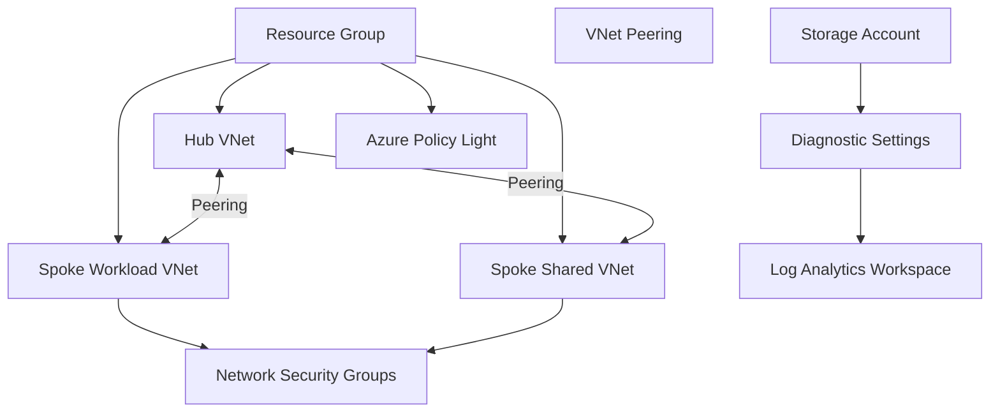

# Architecture

## Azure Landing Zone Lite Foundation

```mermaid
flowchart TB
    RG["Resource Group"]

    HUB["Hub VNet"]
    SPOKE1["Spoke Workload VNet"]
    SPOKE2["Spoke Shared VNet"]

    NSG["Network Security Groups"]
    PEER["VNet Peering"]

    LAW["Log Analytics Workspace"]
    DIAG["Diagnostic Settings"]

    POLICY["Azure Policy Light"]
    STORAGE["Storage Account"]

    RG --> HUB
    RG --> SPOKE1
    RG --> SPOKE2

    HUB <-->|Peering| SPOKE1
    HUB <-->|Peering| SPOKE2

    SPOKE1 --> NSG
    SPOKE2 --> NSG

    STORAGE --> DIAG
    DIAG --> LAW

    RG --> POLICY
```